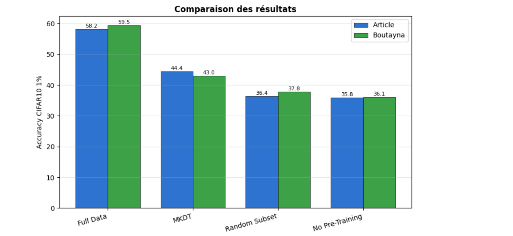
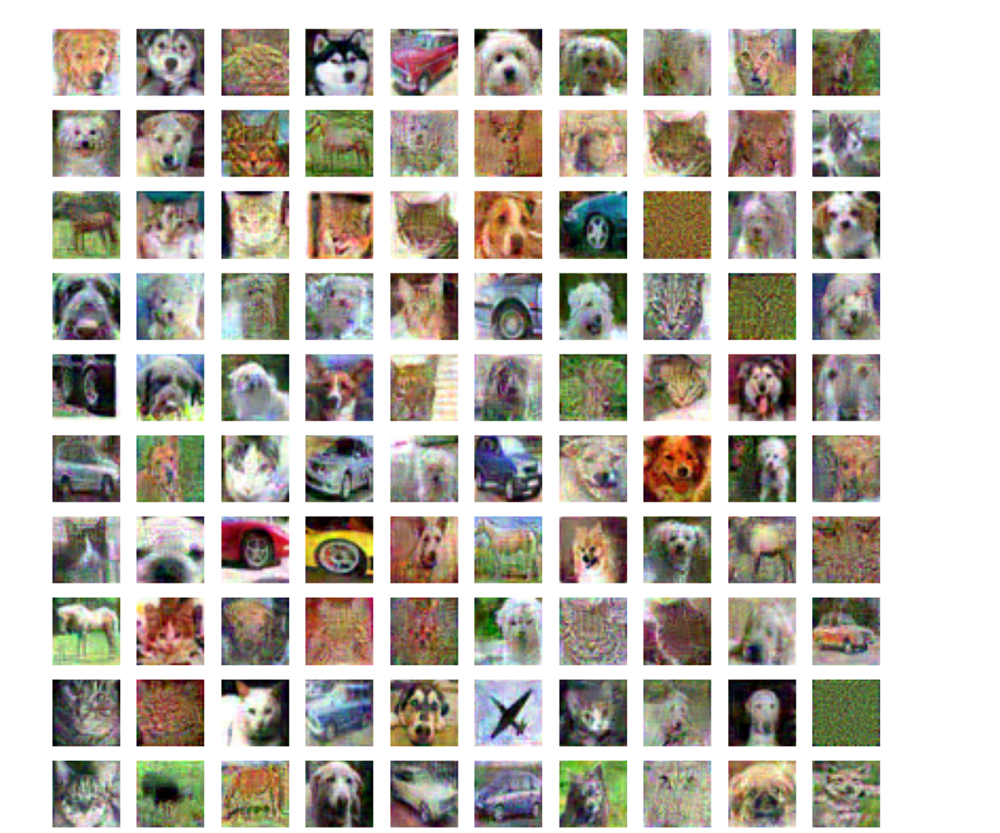

# MKDT for CIFAR-10: Dataset Distillation via Knowledge Distillation

An empirical evaluation and implementation of the **MKDT** (*Matching Knowledge Distillation Trajectory*) method applied to the CIFAR-10 dataset, based on the ICLR 2025 paper: *"Dataset Distillation via Knowledge Distillation: Towards Efficient Self-Supervised Pre-training of Deep Networks"*.

This repository contains the codebase developed to replicate, validate, and analyze the performance of MKDT under strict budget constraints (**1% label fraction**).

---

## Project Overview

**Dataset Distillation (DD)** aims to synthesize a tiny, highly informative subset of data capable of training deep networks effectively while drastically lowering memory and computational overhead. 

While supervised DD has seen significant success, applying it to Self-Supervised Learning (SSL) pre-training typically fails due to the high variance of SSL gradients. **MKDT** overcomes this bottleneck by leveraging **Knowledge Distillation (KD)**:
1. A compact *Student* model is trained to align its representations with a large, SSL-pre-trained *Teacher* model.
2. The small synthetic dataset is generated by forcing an alignment between the training trajectories of these student models.

This project focuses on evaluating MKDT's downstream classification accuracy on **CIFAR-10** using a fraction of only **1% of the labels** (500 synthetic images).

---

## Results

### Accuracy Comparison (CIFAR-10, 1% Labels)

The table below compares the results reported in the original MKDT paper with the results obtained by me.

| Setting | Paper (%) | Our Reproduction (%) |
|----------|------------|----------------------|
| Full Data | 58.2 | **59.5** |
| MKDT | 44.4 | 43.0 |
| Random Subset | 36.4 | 37.8 |
| No Pre-Training | 35.8 | 36.1 |

<p align="center">
  
</p>

**Observations**
- The reproduced MKDT performance (43.0%) is very close to the value reported in the paper (44.4%).
- The distilled dataset significantly outperforms a random subset under the same label budget.
- Results confirm the effectiveness of knowledge-distillation-based dataset distillation, even under strict computational constraints.

---

### Distilled CIFAR-10 Images

Below are examples of the synthetic images generated by MKDT using only **1% of the CIFAR-10 training set** (500 distilled images).

<p align="center">
  
</p>

These images do not necessarily resemble natural photographs but encode discriminative visual information that enables the student network to learn meaningful representations.

---

## Hardware & Infrastructure
* **GPU Accelerator:** All deep learning models and dataset distillation trajectories were accelerated using an **NVIDIA A100-SXM4-40GB GPU** with 40,960 MiB of VRAM.
* **Frameworks:** The core implementation is built on top of `PyTorch` and `Torchvision`, utilizing CUDA acceleration to efficiently handle the high-throughput matrix computations required for matching knowledge distillation trajectories.

---

## Repository Structure

```text
├── MKDT_CIFAR10_train.ipynb  # Training notebook (Teacher-Student KD trajectory generation)
├── MKDT_test.ipynb           # Evaluation, data aggregation, and visualization notebook
└── README.md                 # Project documentation
